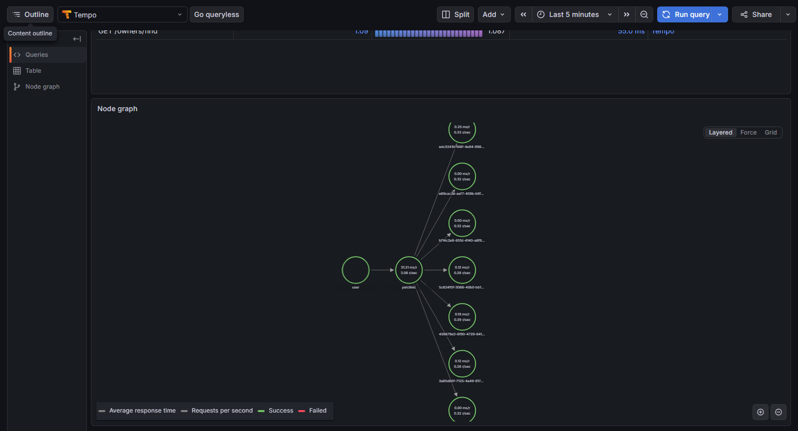
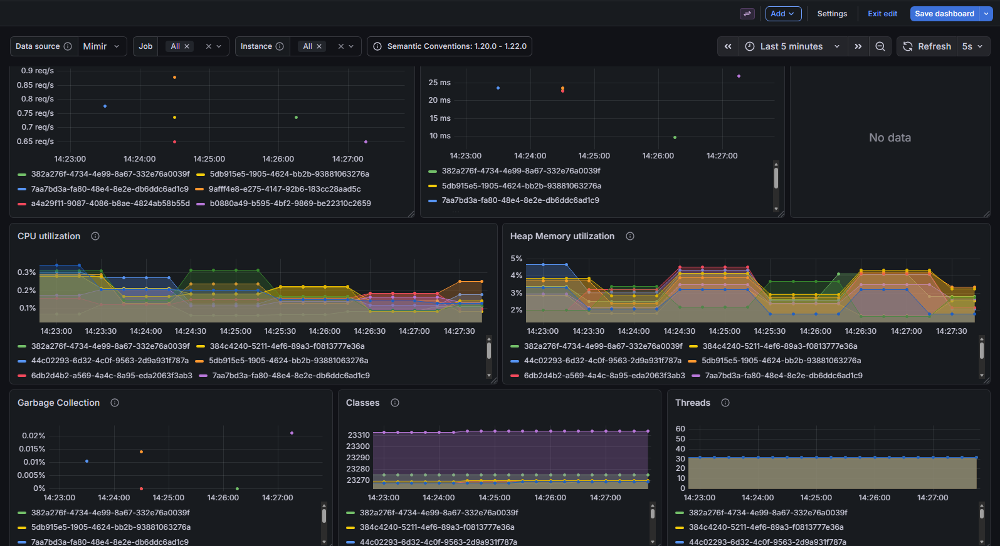
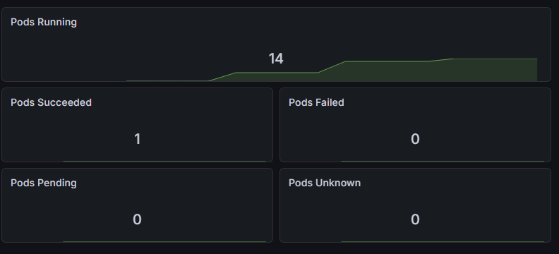

# Spring PetClinic Observability Stack

This project implements the Grafana LGTM stack (Loki, Grafana, Tempo, Mimir) using OpenTelemetry for transparent telemetry collection for the PetClinic Spring Boot application running on Kubernetes.

## 🏗️ Folder Structure

```bash
.
└── petclinic/
    ├── .github/workflows/
    │   └── deploy.yml                    # Github Actions workflow
    ├── alloy/
    │   └── config.river                  # Alloy config (if setup in compose)
    ├── grafana/
    │   ├── provisioning/
    │   │   └── datasources.yml           # Grafana datasource provisioning (if setup in compose)
    │   └── dashboards/                   # Grafana dashboard provisioning (if setup in compose)
    │       └── jvm.json                  
    │       └── k8s.json                  
    ├── k8s/
    │   ├── 00-namespace.yaml             # Namespace creation for isolation
    │   ├── 01-loki.yaml                  # Loki logs storage
    │   ├── 02-tempo.yaml                 # Tempo with metrics generator
    │   ├── 03-mimir.yaml                 # Prometheus metrics storage
    │   ├── 04-grafana-datasources.yaml   # Provisioned dashboards
    │   ├── 05-grafana-provisioning.yaml  # Provisioning for LGTM
    │   ├── 06-grafana.yaml               # Grafana UI
    │   ├── 07-alloy-config.yaml          # ConfigMap containing .river file
    │   ├── 08-alloy.yaml                 # Opentelemetry Collector
    │   ├── 09-petclinic.yaml             # SpringBoot app & HPA
    │   └── 10-ingress.yaml               # Ingress rules for .localhost domains
    ├── mimir/
    │   └── mimir.yaml                    # Mimir config (if setup in compose)
    ├── petclinic/
    │   └── Dockerfile                    # Petclinic custom dockerfile
    ├── tempo/
    │   └── tempo.yaml                    # Tempo config (if setup in compose)
    ├── traffic/
    │   └── load-test.yml                 # Artillery script for putting the app under load
    ├── .gitignore
    ├── README.md
    ├── docker-compose.yml                # Compose for testing pre k8s
    └── ingress-setup.sh                  # Nginx Ingress setup using Helm
```

## 🏗️ Architecture and Data Flow

### 1. OpenTelemetry Java Agent (Generation)
The PetClinic application is instrumented transparently using the OpenTelemetry (OTEL) Java Agent. 
* The agent intercepts user interactions like HTTP requests and database calls.
* It packages these logs, metrics, and traces into the OTLP protocol.
* The data is pushed via HTTP directly to the central collector.

### 2. Grafana Alloy (Processing & Routing)
Grafana Alloy is the telemetry gateway between the application and the storage backends.
* Alloy receives the OTLP data from the PetClinic pod.
* It processes, and routes the telemetry to the appropriate long-term storage databases.

### 3. The LGTM Stack (Storage)
The telemetry is split and stored in three specialized backends:
* **Loki:** Stores all application logs.
* **Mimir:** Stores Prometheus-style metrics (CPU, Memory, Request Rates).
* **Tempo:** Stores the distributed traces. 
  * *Service Graph:* Tempo utilizes a Metrics Generator to scan incoming traces, calculate the connection rates between PetClinic and the in-memory Database, and push those specific connection metrics to Mimir.



<p align="center"><i>1. Service graph under load</i></p>

### 4. Grafana (Visualization)
Grafana is the central UI of the stack. Data sources and dashboards are provisioned via K8s ConfigMaps.
* By combining traces from Tempo with Mimir's generated metrics, Grafana renders a **Service Graph**, visualizing the latency and request rates between the user, the app, and its internal database.



<p align="center"><i>2. JVM Metrics spiking under load</i></p>



<p align="center"><i>3. K8s pod scaling under load</i></p>

---

## 🚀 Implementation Guide

### Prerequisites
* Docker Desktop (with Kubernetes enabled)
* `kubectl` installed and configured.
* `helm` package manager installed.

### 1. Pulling the repository
```bash
git clone https://github.com/akozma0/petclinic.git
cd petclinic
```

### 2. Install the Ingress Controller
Run the script to install NGINX Ingress Controller via Helm:
```bash
./setup-ingress.sh
```

### 3. Deploy the Infrastructure and the App
Apply the k8s directory to spin everything up:
```bash
kubectl apply -f k8s/
```

### 4. Generate Traffic
Using the artillery configuration generate load on the app:
```bash
docker run --rm --add-host petclinic.localhost:host-gateway -v ${PWD}:/scripts artilleryio/artillery:latest run /scripts/load-test.yml
```
### 5. Access the Stack
* **Grafana:** http://grafana.localhost
* **PetClinic:** http://petclinic.localhost
